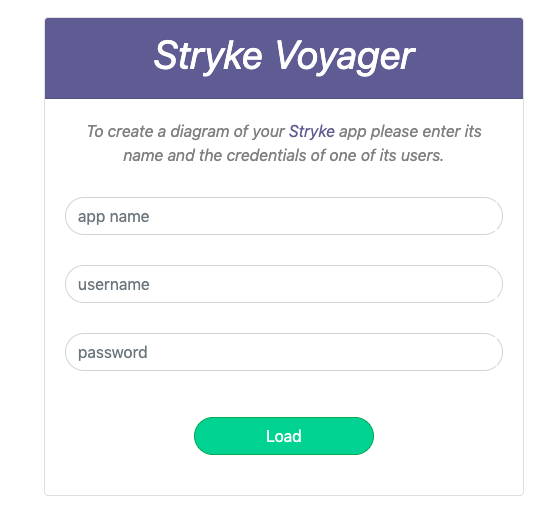
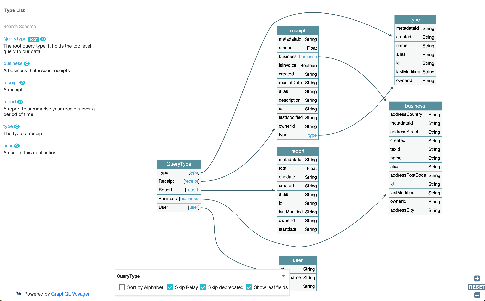

Stryke Voyager
=================

Stryke Voyager creates a diagram of the entities in your [**Stryke app**](www.stryke.io) with all their fields and relationships.

It will also describe all entities and their fields as a searchable documentation based on the names and descriptions you have given them in your app. 

Stryke Voyager uses [GrahQL Voyager](https://github.com/APIs-guru/graphql-voyager) to draw your entites based on the GraphQL schema of your app. 

Usage
------------

1. Upon loading, Stryke Voyager will prompt you for
* An app name
* A username (end user of that app)
* A password 

2. Stryke Voyager will use the detail provided to authenticate against the app, retrieve its schema and immediately log out. 

The schema is then used to render the diagram and docs

**For more info on how to create a Stryke app visit [www.stryke.io](www.stryke.io)**

Demo
------------

Check out our [Glitch project](https://stryke-voyager.glitch.me) for a live demo of Stryke-Voyager. 

https://stryke-voyager.glitch.me